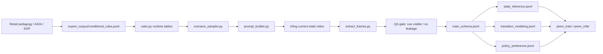

# PIWM 数据生成闭环主计划

更新时间：2026-04-29

## 0. 核心判断

本项目当前的首要目标不是先优化训练/推理架构，而是先打通可信的数据生成闭环：

```text
专家规则 -> 场景采样 -> Kling 当前状态视频 -> 抽帧与 QA -> 主 schema -> 三套训练数据 -> 训练/推理代码
```

训练代码只有在数据格式稳定之后才有意义。当前 Claude 生成的 method-side implementation spec 已保存到 [archive/06_piwm_implementation_spec_method_side_blocked.md](archive/06_piwm_implementation_spec_method_side_blocked.md)，但它依赖两个尚未完成的数据契约：

- `state_inference.jsonl` / `transition_modeling.jsonl` 需要显式 `bdi` / `next_bdi`；
- `policy_preference.jsonl.meta` 需要 `state_summary` 与结构化 `candidate_block`。

因此，当前执行顺序必须以数据闭环优先。

## 1. 当前闭环结构



## 2. 活跃阶段

### Phase 0：Claim-to-Artifact 审计

目标：确认论文 v6 的每个关键 claim 都有明确代码或数据工件承接。

必须覆盖：

- pedagogy-derived action space；
- AIDA-BDI state representation；
- Kling renders visual side, not labels；
- unified interaction schema；
- state / transition / preference 三套 supervision；
- OOD split；
- internal simulator inference。

产出：

- [00_claim_to_artifact_audit.md](00_claim_to_artifact_audit.md)

进入下一阶段条件：

- 所有 P0 claim 标为 `covered` 或 `blocking`；
- 不允许把未实现的 claim 写成已完成。

### Phase 1：专家规则语料层

目标：让当前规则不再只表现为 `rules.py` 硬编码。

产出：

- `piwm_data/expert_corpus/schemas.py`
- `piwm_data/expert_corpus/compile.py`
- `piwm_data/expert_corpus/distilled/conditional_rules.jsonl`
- `piwm_data/expert_corpus/distilled/_conflict_log.jsonl`
- `tests/test_expert_corpus.py`

验收：

- 五张核心规则表 + 一张 fallback intent 表从 `conditional_rules.jsonl` 编译；
- 编译结果条数匹配当前基线：10 / 14 / 9 / 9 / 9 / 21；
- `python3 -m pytest` 全部通过；
- seed rule 明确标注，不伪装真实教材来源。

进入下一阶段条件：

- 现有 36 个测试不回退；
- 新增 expert corpus 测试通过；
- conflict log 可生成且无未解释冲突。

### Phase 2：数据契约升级

目标：解除 method-side implementation spec 的 P0 阻塞。

产出：

- `MainSchemaRecord.bdi`
- `state_inference.output.aida_stage`
- `state_inference.output.bdi`
- `transition_modeling.output.next_aida_stage`
- `transition_modeling.output.next_bdi`
- `policy_preference.meta.state_summary`
- `policy_preference.meta.candidate_block`
- `reward_components`

验收：

- `aida_stage` 对应论文中的 `sigma_t`；
- `belief / desire / intention` 三字段非空；
- `latent_state` 定位为 `state_subtype`，不再冒充 AIDA stage；
- reward 标量能由 `alpha * delta_stage + beta * delta_mental - gamma * action_cost` 解释；
- `candidate_block` 使用结构化 list/dict，不直接输出拼好的 prompt 字符串；
- `state_summary` 明确包含 `aida_stage`、`bdi`、`state_subtype`；
- exporter 对旧 `intent` 的兼容策略写入测试。

进入下一阶段条件：

- method-side target 构造所需字段全部存在；
- schema/exporter/validator 测试全部通过。

### Phase 3：场景采样与 Prompt 构造

目标：让 Kling 输入由规则和 coverage 计划自动产生。

产出：

- `scripts/scenario_sampler.py`
- `scripts/prompt_builder.py`
- `data/scenario_manifest.jsonl`

验收：

- 每条样本有 `session_id`、`split`、`product_category`、`persona_type`、`aida_stage`、`target_cue`、`source_rule_ids`；
- prompt 不泄露 state/action 标签；
- prompt 有 camera / scene / behavior timeline / negative 四层；
- train / dev / test / ood_product / ood_persona split 可复现。

进入下一阶段条件：

- 10 条 dry-run prompt 人工审阅通过；
- target cue 都能转写成可见行为描述。

### Phase 4：Kling 生成、抽帧与 QA Gate

目标：只允许视觉 cue 真实可见的样本进入训练数据。

产出：

- `Archive_generated/<session_id>/video.mp4`
- `Archive_generated/<session_id>/frames/*.jpg`
- `Archive_generated/<session_id>/frame_manifest.json`
- `Archive_generated/<session_id>/qa_report.json`
- `scripts/extract_frames.py`

验收：

- 视频存在且时长/帧数达标；
- 抽帧成功；
- `training_input_mode = multi_image_single_turn`；
- 无字幕、品牌、额外主角、明显标签泄露；
- target cue 在 sampled frames 中可见；
- QA fail 样本写入 reject log，不进入 dataset build。

进入下一阶段条件：

- 小批量样本 QA pass rate 可接受；
- 至少 30 条 QA pass session 可被 loader 读取。

### Phase 5：小规模 Dataset Pilot

目标：用真实生成的 QA pass session 跑完训练数据导出。

产出：

- `data/piwm_dataset/main_schema.jsonl`
- `data/piwm_dataset/state_inference.jsonl`
- `data/piwm_dataset/transition_modeling.jsonl`
- `data/piwm_dataset/policy_preference.jsonl`
- `data/piwm_dataset/_stats.json`

验收：

- loader 只吃 QA pass 样本；
- 三套 JSONL 非空；
- `policy_preference` 不产生 malformed pair；
- `transition_modeling` 统计 `n_states_with_action_contrast`；
- `_stats.json` 记录 loaded / skipped / rejected 计数；
- `python3 -m pytest` 全部通过。

进入下一阶段条件：

- method-side spec 中步骤 1-7 可以用 pilot 数据 fixture 做非 GPU 测试；
- DPO 所需 preference meta 字段齐全。

### Phase 6：训练/推理代码解锁

目标：在数据契约稳定后，回到 `piwm_train` / `piwm_infer`。

产出：

- `piwm_train/config.py`
- `piwm_train/targets.py`
- `piwm_train/prompts.py`
- `piwm_infer/parsers.py`
- `piwm_infer/decision_loop.py`

验收：

- 无 GPU 步骤只依赖 mock fixture；
- parser 出错即 raise，不做 fuzzy match；
- `stage` 与 `latent_state` 字段语义不混用；
- `pyproject.toml` 纳入新增测试路径。

进入下一阶段条件：

- pilot 数据可被 target builder 读取；
- `piwm_train` / `piwm_infer` 单测通过；
- GPU 训练入口另开阶段。

## 3. 当前阻塞

1. 还没有 `expert_corpus`，论文中的 pedagogy-derived claim 缺代码证据。
2. 当前 data pipeline 没有显式 BDI，method-side spec 暂不能直接实现。
3. 当前 Kling wrapper 只能调用 API，不能构造受控视频 prompt。
4. 当前没有 QA gate，标签可能与视频画面脱钩。
5. 当前 OOD split 还没有进入 sampler，不能支撑 v6 的 OOD gap claim。
6. 当前 reward 仍是标量 hard-code，不能支撑论文里的三项分解 claim。
7. 当前 real-store split 没有 schema 和隐私/授权 metadata，不能支撑论文 real-store test claim。

## 4. 当前不做

- 不直接实现 `piwm_train.sft` / `piwm_train.dpo`；
- 不让 Kling 生成 action-continuation video；
- 不把旧 Archive 迁移作为主线；
- 不伪造真实销售手册引用；
- 不把 seed rules 写成真实教材蒸馏结果。
