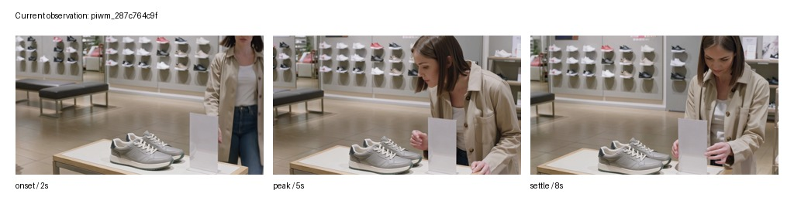
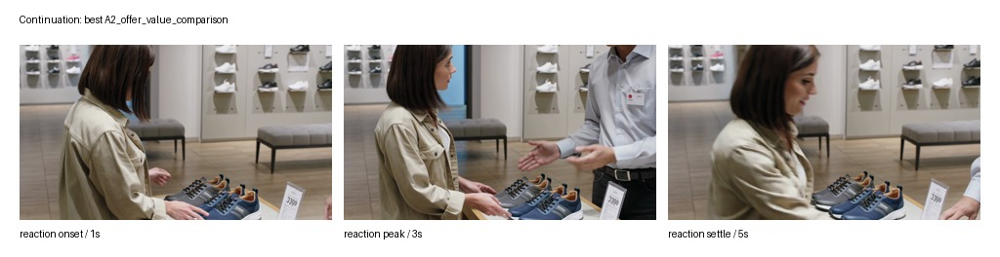
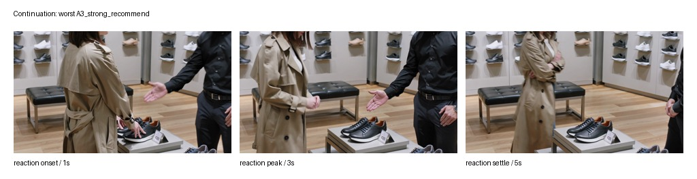

# PIWM 数据样本手册：从画面到训练题

更新时间：2026-05-02 CST

这份文档不是“简单举例”。它的目的，是把一条 PIWM 数据样本从画面、标签、训练任务、展示话术到当前问题完整拆开，避免出现两个常见误解：

1. 只看 JSON 字段，会觉得模型输出太粗、太像模板。
2. 只看效果表，会不知道这些提升到底对应到哪种真实样本。

本文采用一个主案例贯穿说明：

```text
case_id: piwm_287c764c9f
商品: footwear / 鞋类
视角: salesperson_observable / 导购可观察视角
观察线索: long_dwell_with_price_check / 长时间停留并反复查看价格
当前状态: high_hesitation / 高犹豫
最佳动作: A2_offer_value_comparison / 提供价值对比
高风险动作: A3_strong_recommend / 强推荐
```

这个案例适合展示 PIWM 的核心逻辑：同一个顾客当前状态下，不同导购动作会导向不同的可见后果。

---

## 1. 先看画面证据，而不是先看标签

### 1.1 当前顾客状态



这组帧的可读信息是：

| 观察维度 | 画面中能看到什么 | 对数据标签的作用 |
|---|---|---|
| 商品关系 | 顾客停留在鞋类商品区域，注意力集中在货架/商品附近 | 支持“已经进入考虑阶段”，不是路过 |
| 停留与比较 | 顾客持续看向商品区域，姿态没有快速离开 | 支持 `long_dwell_with_price_check` |
| 导购可见性 | 画面是中近距离，能看到顾客身体姿态和商品区域 | 支持 `salesperson_observable` 视角 |
| 干预时机 | 顾客已经有兴趣，但还没有明确购买动作 | 支持“可以轻度主动介入，但不宜强推” |

这一步的关键不是“模型猜中了一个标签”，而是确认训练输入里确实有可观察证据。如果画面看不出顾客停留、比较、看价，后面的标签再漂亮也不可靠。

---

## 2. 这条样本的机器标签长什么样

新版数据不再直接从图片跳到 `observable_cues` 或 `best_action`。它先写一层 `visual_state`，也就是模型应该先读出的可观察事实：

```json
{
  "state_id": "piwm_287c764c9f",
  "product_category": "footwear",
  "viewpoint": "salesperson_observable",
  "visual_state": {
    "summary": "顾客持续停留在商品区域，并反复关注价格或价值信息，表现为有兴趣但仍在犹豫。 场景为鞋类商品，视角为导购可观察中近距离视角。",
    "engagement_pattern": "顾客和商品保持稳定关系，不是快速经过；注意力围绕商品和价格区域。 移动速度较慢或基本停留，缺少快速离场动作。",
    "gaze_and_attention": "视线持续落在商品、价签或附近陈列区域，呈现反复查看而非一次性扫视。",
    "body_and_hands": "身体朝向商品区域，姿态相对停留，没有明显转身离开。 手部没有快速离开商品区域，可能停在商品附近或保持比较姿态。"
  },
  "observable_cues": ["long_dwell_with_price_check"],
  "aida_stage": "desire",
  "latent_state": "high_hesitation",
  "intent": "seek_reassurance",
  "bdi": {
    "belief": "The offer may not yet justify its price.",
    "desire": "gain reassurance before deciding",
    "intention": "look for reassurance or clarification"
  },
  "candidate_actions": [
    "A2_offer_value_comparison",
    "A4_open_with_question",
    "A6_acknowledge_and_wait",
    "A3_strong_recommend"
  ],
  "best_action": "A2_offer_value_comparison",
  "best_action_realization": {
    "utterance": "我看您在比较这几款鞋类商品，如果您愿意，我可以帮您把价格、材质和适合场景放在一起对比一下，您不用马上决定。",
    "physical_action": "站在顾客侧前方半步外，指向两到三个鞋类商品选项，用手势对比材质、功能、价格或使用场景。",
    "timing": "在顾客持续停留或反复看价格时，从侧前方低压力介入。",
    "rationale": "顾客已经有兴趣但还在犹豫；她一直在看商品和价格，可能是在判断值不值得。价值对比能降低决策成本，而不是增加压力。"
  }
}
```

这段 JSON 有训练价值，但它不是适合直接给人看的最终话术。原因很明确：

| 字段 | 训练侧作用 | 人读起来的问题 | 展示时应如何渲染 |
|---|---|---|---|
| `visual_state` | 让模型先输出可见事实，便于检查错误发生在哪一步 | 目前仍由 cue template 派生，不等于人工逐帧标注 | “顾客持续看向商品区域，姿态没有快速离开” |
| `observable_cues` | 让模型学习从画面到可见线索 | 枚举名很硬 | “顾客长时间停留，并反复关注价格/价值信息” |
| `latent_state` | 统一状态标签，方便评估 | `high_hesitation` 不是自然语言 | “顾客有明显兴趣，但决策仍犹豫” |
| `bdi.belief` | 给模型一个顾客心理摘要目标 | 仍是规则派生，不等于真实读心 | “顾客可能觉得价格/价值还没完全说服自己” |
| `best_action` | 训练最终动作选择 | 枚举名不可读 | “先做价值对比，而不是直接强推” |
| `best_action_realization` | 训练模型输出具体干预 | 仍需要按品牌/商品进一步润色 | “说什么、站哪里、何时介入、为什么这样做” |

所以当前最稳的展示方式，是把机器标签经过一层可审计的中文解释渲染：

> 顾客已经停留在鞋类商品前，并持续关注商品和价格信息，说明她不是随便路过，而是进入了比较和犹豫阶段。此时适合低压力介入，帮助她比较不同选项的价值；不适合直接强推某一款，因为这可能让顾客感到被催促。

这不是“美化结果冒充模型原话”，而是把结构化字段翻译成人能读懂的话。论文和 demo 中需要区分：

```text
raw model/data output  = 机器学习和评估用的结构化标签
human-facing rendering = 面向导师/观众的解释层
```

当前工程口径：`proactive_score` 暂时保留为内部兼容字段，因为旧的 e2e gate 和评估脚本还依赖 1-5 分数；但新样本的主语义已经改成 `visual_state` 和 `best_action_realization`。后续训练展示不应把 `score=4` 当作核心输出。

---

## 3. 同一状态下，不同动作的后果

这条样本对应四个候选导购动作。规则监督给出的结果如下：

| 候选动作 | 给非技术读者的说法 | 预期下一状态 | 风险 | 收益 | 奖励 | 解释 |
|---|---|---|---|---|---:|---|
| `A2_offer_value_comparison` | 提供价值对比 | `engaged_dialogue` | low | high | +0.80 | 最适合当前犹豫：帮助顾客比较价值，降低决策成本 |
| `A4_open_with_question` | 开放式询问需求 | `engaged_dialogue` | low | high | +0.60 | 也合适，但没有直接解决价格/价值犹豫 |
| `A6_acknowledge_and_wait` | 礼貌确认后等待 | `continued_hesitation` | low | medium | +0.40 | 不冒犯，但推动有限 |
| `A3_strong_recommend` | 强烈推荐某一款 | `defensive_withdrawal` | high | low | -0.50 | 对犹豫顾客压力过大，容易引发退缩 |

这里最重要的不是奖励数值本身，而是“同一个当前画面 + 不同动作 → 不同后果”的结构。PIWM 的 World Model 叙事必须建立在这个结构上。

---

## 4. 后续反应视频：让动作后果变成可看的证据

### 4.1 温和价值对比后的正向后果

动作：`A2_offer_value_comparison`



这组 continuation frames 的数据解释是：

```json
{
  "candidate_action": "A2_offer_value_comparison",
  "next_state": "engaged_dialogue",
  "risk": "low",
  "benefit": "high",
  "reward": 0.8,
  "reaction_caption": "the customer turns toward the salesperson area, opens posture, and stays engaged with the product"
}
```

给人看的解释应写成：

> 导购没有直接强推，而是在商品旁做比较说明。顾客仍停留在商品区域，身体没有后撤，注意力继续围绕商品和导购互动。这符合“温和价值对比可能带来继续交流”的规则预期。

### 4.2 强推荐后的负向后果

动作：`A3_strong_recommend`



这组 continuation frames 的数据解释是：

```json
{
  "candidate_action": "A3_strong_recommend",
  "next_state": "defensive_withdrawal",
  "risk": "high",
  "benefit": "low",
  "reward": -0.5,
  "reaction_caption": "the customer steps back, breaks eye contact, and retracts hands from the product"
}
```

给人看的解释应写成：

> 导购以更强的姿态推进推荐后，顾客的身体语言变得更封闭：后撤、收手、视线从导购和商品上移开。这不是“购买意愿增强”的画面，而更接近防御性退缩。

---

## 5. Future Verification：不是让模型生成未来，而是验证未来是否匹配

当前 World Model 最有价值的训练题，不是让模型凭空生成未来视频，而是让它判断：

```text
当前顾客画面 + 某个导购动作 + 一组后续反应画面
→ 这组后续反应是否符合该动作的规则预期？
```

用同一个案例，可以构造四类判断题：

| 输入组合 | 标准答案 | 为什么 |
|---|---|---|
| 当前画面 + `A2_offer_value_comparison` + A2 正向后续画面 | match = yes | 温和价值对比后，顾客继续互动，符合 `engaged_dialogue` |
| 当前画面 + `A2_offer_value_comparison` + A3 退缩后续画面 | match = no | A2 预期是继续互动，但画面像退缩 |
| 当前画面 + `A3_strong_recommend` + A3 退缩后续画面 | match = yes | 强推后顾客退缩，符合 `defensive_withdrawal` |
| 当前画面 + `A3_strong_recommend` + A2 正向后续画面 | match = no | A3 预期是高压风险，但画面像温和互动后的结果 |

其中一条正样本的原始格式是：

```json
{
  "input": {
    "current_frames": ["frames/000.jpg", "frames/001.jpg", "frames/002.jpg"],
    "candidate_action": "A2_offer_value_comparison",
    "continuation_frames": [
      "continuations/best_A2_offer_value_comparison/frames/000.jpg",
      "continuations/best_A2_offer_value_comparison/frames/001.jpg",
      "continuations/best_A2_offer_value_comparison/frames/002.jpg"
    ]
  },
  "output": {
    "match": "yes",
    "expected_next_state": "engaged_dialogue",
    "visible_reaction": {
      "body_change": "customer turns body toward salesperson area, makes brief eye contact, body posture opens up",
      "gaze_change": "head turns to engage, gaze alternates between salesperson area and product",
      "hand_change": "hands stay relaxed near or on the product, may gesture toward features",
      "movement_change": "weight shifts forward, leans slightly in"
    }
  }
}
```

这比单纯输出 `next_state=engaged_dialogue` 更好，因为它要求模型看后续画面里的身体、视线、手部和移动变化。

---

## 6. 四个正式数据集各自到底长什么样

### 6.1 `PIWM-Train-Synth-v1`：训练模型的合成题库

规模：543 个顾客场景，2554 条 SFT 训练样本。

一条训练样本不是只包含“答案”，而是包含：

```text
输入: 多张当前顾客画面 + 任务指令
输出: 结构化标签或动作后果
```

它会混合多类任务，例如：

| 任务类型 | 输入 | 输出 |
|---|---|---|
| 状态识别 | 当前顾客 3 帧图像 | 顾客阶段、心理摘要、是否适合主动介入、候选动作 |
| 动作后果 | 当前顾客 3 帧图像 + 一个导购动作 | 下一状态、风险、收益、奖励 |
| 后续反应描述 | 当前顾客 3 帧图像 + 一个导购动作 | 顾客可能出现的可见反应描述 |
| 未来匹配判断 | 当前顾客 3 帧图像 + 动作 + 后续反应帧 | match / mismatch |

对外不要说它全部人工验收通过。准确说法是：

> 这是用于训练的 synthetic dataset，其中标签来自受控场景、规则表和自动导出；人工验收评估使用单独的 QA subset。

### 6.2 `PIWM-Eval-QA-v1`：人工看过的考试集

规模：36 个 QA-pass 顾客场景，162 道评估题。

它的价值不是规模大，而是干净：每个场景至少经过人工检查，确认关键帧基本能支持标签。

典型评估题是：

```text
给模型当前顾客画面：
1. 判断顾客当前阶段
2. 判断是否适合主动介入
3. 给出候选导购动作
4. 对每个动作预测风险、收益、下一状态
```

这个集合最适合用于效果表，因为它的画面和标签一致性比未审阅 synthetic 更可靠。

### 6.3 `PIWM-WorldModel-v1`：动作后果视频证据

规模：24 个顾客场景，44 段后续反应视频。

它不是主训练规模来源，而是用来说明：

```text
同一个当前顾客状态
+ 不同导购动作
→ 可以构造不同的可见后续反应
```

`piwm_287c764c9f` 就是其中一个最适合展示的案例：

| 当前状态 | 动作 | 后续反应 |
|---|---|---|
| 高犹豫，看鞋类价格/价值 | 提供价值对比 | 顾客继续互动，身体姿态打开 |
| 高犹豫，看鞋类价格/价值 | 强推荐 | 顾客后撤、收手、视线回避 |

### 6.4 `PIWM-FutureVerification-v1`：动作和后果是否匹配的判断题

规模：84 条判断题。

它把 `PIWM-WorldModel-v1` 的后续反应视频进一步转成训练任务：

```text
当前画面 + 动作 + 后续反应画面
→ 判断这段后续反应是否符合这个动作
```

这就是我们目前最适合解释 “World Model 不只是文本规则” 的地方。因为 continuation frames 真正进入了模型输入，而不是只作为报告里的展示图。

---

## 7. 当前模型输出为什么显得粗

这个问题要正面承认。当前训练后的模型输出粗，主要有四个原因：

1. **训练目标是结构化字段，不是自然语言导购报告。**
   模型被训练成输出 `<stage>...</stage>`、`<risk>...</risk>`、`<reward>...</reward>` 这类可解析标签，所以原始输出天然不像人写的解释。

2. **BDI 文本仍有模板痕迹。**
   例如 `The offer may not yet justify its price. Persona: experienced_brand_loyal.` 对训练有用，但作为用户建模解释还不够细腻。

3. **动作后果标签是规则派生的粗粒度监督。**
   `risk=low/high`、`benefit=high/low`、`reward=0.8/-0.5` 能让模型学会规则，但不能直接等同于真实销售结果。

4. **最终 demo 缺少解释渲染层。**
   如果把 raw XML / JSON 原样贴给观众，观众会觉得模型“只会填表”。应该展示 raw output + rendered explanation 两层。

更合理的 demo 格式应该是：

| 层次 | 展示内容 |
|---|---|
| 原始模型输出 | 保留真实标签，证明不是人工编的 |
| 解析结果 | 把标签转成表格，说明模型是否答对 |
| 人读解释 | 用模板/人工 renderer 把结果翻译成自然语言 |
| 画面证据 | 放 contact sheet，证明解释不是脱离画面 |

### 7.1 模型是不是 thinking 模型？

当前训练配置里的主模型是 `Qwen/Qwen3-VL-8B-Instruct`，不是专门的 Thinking / Reasoning 版本。PIWM 当前也没有把隐藏思维链作为训练目标。我们训练的是可审计的结构化输出：

```text
视觉事实 -> 用户状态 -> 是否介入 -> 候选动作 -> 具体干预话术/动作 -> 后果预测
```

因此，不能指望模型靠不可见的 chain-of-thought 自己把推理说清楚。更稳的做法是把中间推理拆成显式字段，例如 `visual_state.engagement_pattern`、`visual_state.gaze_and_attention`、`visual_state.body_and_hands`、`best_action_realization.utterance`。这样模型哪里错了可以被检查：

```text
如果 visual_state 错了，是看图问题；
如果 visual_state 对但 latent_state 错了，是状态映射问题；
如果状态对但 best_action_realization 错了，是策略/话术问题。
```

---

## 8. 推荐给 lead / 导师看的单页 demo 结构

如果只给别人看一页，不要贴完整 JSON。建议这样排：

### 标题

```text
同一顾客状态下，不同导购动作会导致不同可见反应
```

### 上半部分：三张图

1. 当前顾客：长时间看鞋和价格，处于高犹豫。
2. 温和价值对比：顾客继续互动，身体姿态打开。
3. 强推荐：顾客后撤、收手、视线回避。

### 下半部分：一张表

| 动作 | 模型/规则预期 | 画面反应 | 结论 |
|---|---|---|---|
| 价值对比 | 继续交流，收益高 | 顾客保持互动 | 合理 |
| 强推荐 | 防御退缩，风险高 | 顾客后撤收手 | 不宜 |

### 一句话解释

> PIWM 的目标不是让模型直接生成未来视频，而是让模型从当前顾客视觉状态出发，比较不同导购动作的可见后果，并判断哪种干预更合适。

---

## 9. 这条样本能证明什么，不能证明什么

### 可以证明

- 当前数据不是纯文本标签，而是从店内视觉场景抽帧而来。
- 一个顾客当前状态可以展开多个候选导购动作。
- 不同动作可以对应不同的可见后续反应。
- Future Verification 可以把后续反应画面纳入训练输入。

### 不能证明

- 不能证明这些视频是真实店铺采集。
- 不能证明奖励分数是真实销售转化率。
- 不能证明模型已经能自然生成高质量导购建议。
- 不能证明所有 synthetic 场景都人工验收通过。

这几个边界必须保留。否则 reviewer 会很容易质疑数据口径。

---

## 10. 下一步打磨重点

| 优先级 | 问题 | 应该怎么改 |
|---|---|---|
| P0 | 模型 raw output 太像标签填空 | 增加 renderer，把结构化输出转成自然语言解释，同时保留 raw output |
| P0 | BDI 文本模板感强 | 已新增 `visual_state`；下一步把 BDI 从 persona 模板改为基于 `visual_state` 的心理摘要 |
| P0 | `best_action` 只有动作标签 | 已新增 `best_action_realization`，输出具体站位、动作、话术、介入时机和理由 |
| P1 | 效果表里规则项过于接近满分 | 主文合并为“规则化动作后果标签”，不要拆成多个 100% 指标 |
| P1 | World Model 样本少 | 现有 Kling API 已耗尽，当前版本先用 44 continuation + 84 verification；后续有额度再扩 |
| P2 | 对外 demo 缺少可视化排版 | 用 `piwm_287c764c9f` 做固定 demo slide / README section |

当前最重要的判断是：

> 训练用 raw labels 可以粗，但展示给人看的 explanation 不能粗。下一步不是篡改模型输出，而是建立“raw output → parsed fields → human-facing explanation”的可审计展示层。
