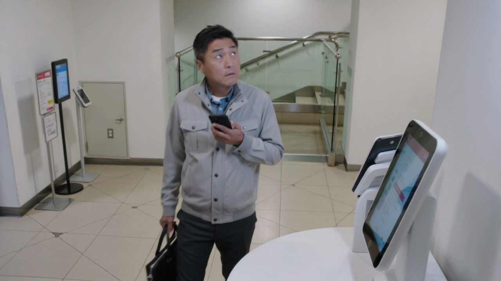
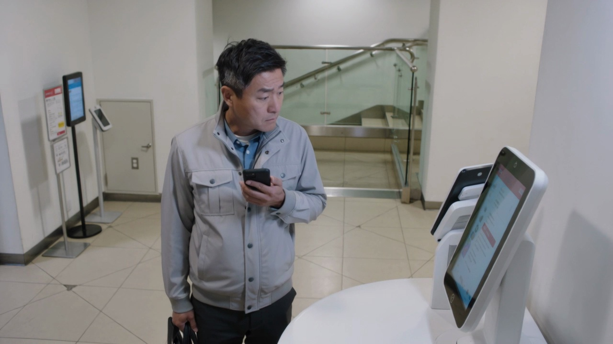
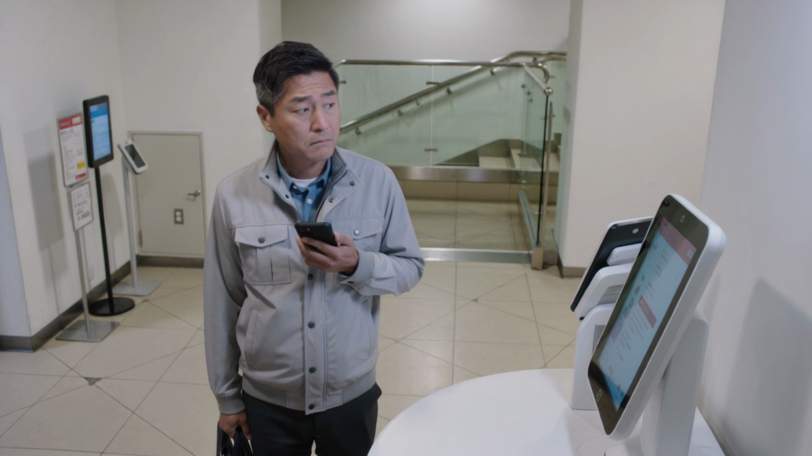

# Sample 06

## 视频画面 (3 帧)

时间顺序：t=0 / t=midpoint / t=end。

[Frame 1: frames/sample_06_frame_01.jpg]

[Frame 2: frames/sample_06_frame_02.jpg]

[Frame 3: frames/sample_06_frame_03.jpg]

## 顾客状态

- **AIDA 阶段**: attention
- **意图**: no_clear_intent
- **信念 (belief)**: 他隐约注意到前方有可购买饮品或零食的零售设备，但不确定是否有自己需要的东西。
- **愿望 (desire)**: 他只想快速判断这里是否值得停留，避免耽误返回办公室的时间。
- **意图行为 (intention)**: 他倾向于短暂扫视后直接离开，除非立刻发现非常合适的选择。
- **可观察证据 (observable evidence)**: 他在镜头前短暂停步，视线从上到下快速扫过前方区域，随后目光游移，左手手机停在胸前，右手公文包轻微晃动，没有进一步靠近或操作的动作。

## 候选介入动作

| ID | 动作类型 | 说话内容 | 屏幕显示 | 物理动作 |
|---|---|---|---|---|
| Greet_attention_stage_conditioned_target_piwm_705_9bb7c9fa3e60 | Greet | 欢迎光临，需要时我可以帮您。 | {'action': 'show_welcome_message', 'cta': None} | 智能售货柜以简短欢迎语和柔和灯效提示可用性。 |
| Elicit_b1166d372e5e | Elicit | 您今天想先看价格、功能，还是适合什么场景？ | {'action': 'show_choice_bubbles', 'choices': ['价格', '功能', '场景'], 'cta': None} | 智能售货柜通过屏幕、语音、灯效和必要的柜体反馈执行响应。 |
| Inform_5ff00ba15ca5 | Inform | 我给您演示一下这款的关键细节。 | {'action': 'play_product_demo', 'target': '{candidate_item}', 'cta': None} | 智能售货柜按屏幕、语音、灯效执行该候选响应。 |
| Hold_eda24b4bb712 | Hold | （静默） | {'action': 'idle_minimal', 'cta': None} | 智能售货柜按屏幕、语音、灯效执行该候选响应。 |

## 你的选择

请从候选中选一个动作类型，并写到 `annotation_template.csv` 对应行的 `chosen_action` 列。
可选值只能是：`Greet` / `Elicit` / `Inform` / `Recommend` / `Hold`。
