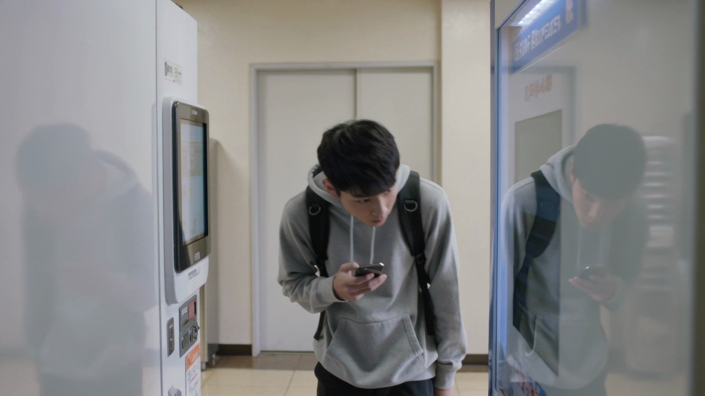
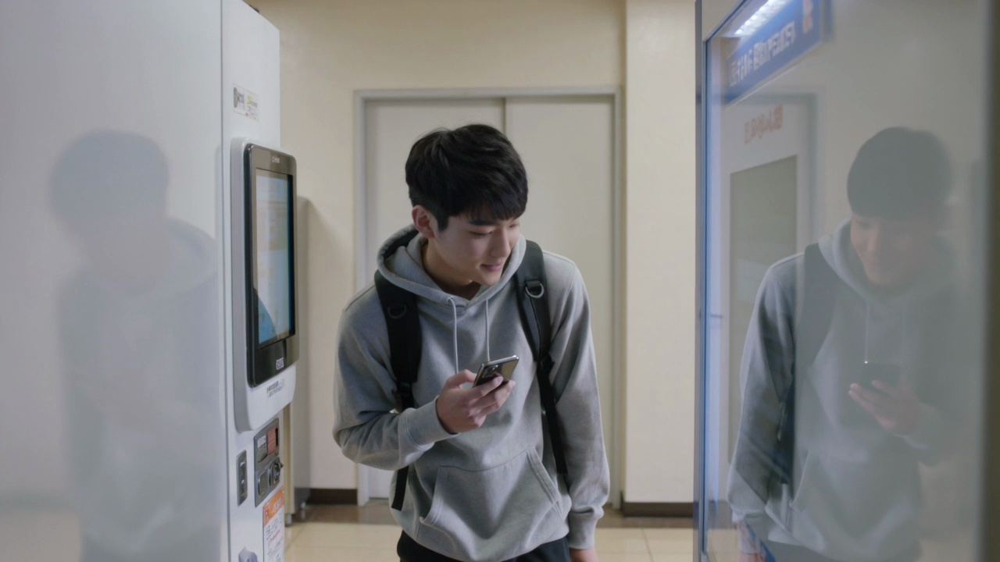

# Sample 07

## 视频画面 (3 帧)

时间顺序：t=0 / t=midpoint / t=end。

[Frame 1: frames/sample_07_frame_01.jpg]

[Frame 2: frames/sample_07_frame_02.jpg]

[Frame 3: frames/sample_07_frame_03.jpg]

## 顾客状态

- **AIDA 阶段**: interest
- **意图**: explore_options
- **信念 (belief)**: 他认为眼前的选择里可能有适合自己课间补充能量的饮品或零食。
- **愿望 (desire)**: 他想快速了解有哪些看起来合适的选项，并挑出一个感兴趣的目标。
- **意图行为 (intention)**: 他倾向继续查看不同区域，很快做出选择。
- **可观察证据 (observable evidence)**: 他停在设备前，目光积极地在不同区域来回扫视，偶尔轻轻点头，双手自然放在画面内，一只手握着手机，动作轻松而连贯。

## 候选介入动作

| ID | 动作类型 | 说话内容 | 屏幕显示 | 物理动作 |
|---|---|---|---|---|
| Elicit_b1166d372e5e | Elicit | 您今天想先看价格、功能，还是适合什么场景？ | {'action': 'show_choice_bubbles', 'choices': ['价格', '功能', '场景'], 'cta': None} | 智能售货柜通过屏幕、语音、灯效和必要的柜体反馈执行响应。 |
| Inform_24926eed1e21 | Inform | 您好，需要时我可以帮您说明。 | {'action': 'show_comparison_or_details', 'target': '{candidate_items}', 'cta': None} | 智能售货柜按屏幕、语音、灯效执行该候选响应。 |
| Recommend_interest_stage_conditioned_target_piwm_706_673bc7e63644 | Recommend | 如果您想省心选择，可以优先看这款更稳妥的。 | {'action': 'highlight_soft_recommendation', 'cta': None} | 智能售货柜轻量高亮一个选项，并保留顾客选择空间。 |
| Hold_eda24b4bb712 | Hold | （静默） | {'action': 'idle_minimal', 'cta': None} | 智能售货柜按屏幕、语音、灯效执行该候选响应。 |

## 你的选择

请从候选中选一个动作类型，并写到 `annotation_template.csv` 对应行的 `chosen_action` 列。
可选值只能是：`Greet` / `Elicit` / `Inform` / `Recommend` / `Hold`。
