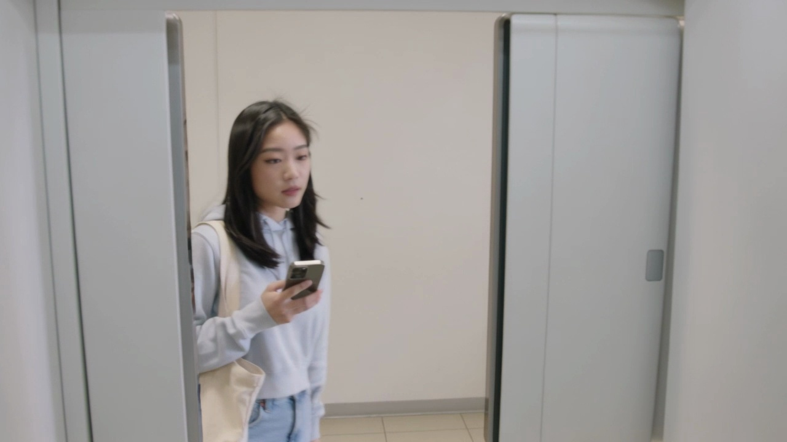

# Sample 08

## 视频画面 (3 帧)

时间顺序：t=0 / t=midpoint / t=end。

[Frame 1: frames/sample_08_frame_01.jpg]

[Frame 2: frames/sample_08_frame_02.jpg]

[Frame 3: frames/sample_08_frame_03.jpg]

## 顾客状态

- **AIDA 阶段**: interest
- **意图**: compare_value_for_money
- **信念 (belief)**: 她认为眼前可选的饮品看起来比较符合自己现在想喝点清爽饮料的需求。
- **愿望 (desire)**: 她想快速挑出一瓶口味合适、喝起来轻松的饮品。
- **意图行为 (intention)**: 她倾向于继续对比两三个选项后很快做出选择。
- **可观察证据 (observable evidence)**: 她的目光在不同位置之间来回停留，右手握着手机，左手轻轻抬起又放下，像是在对比选项但没有明显纠结。

## 候选介入动作

| ID | 动作类型 | 说话内容 | 屏幕显示 | 物理动作 |
|---|---|---|---|---|
| Elicit_interest_stage_conditioned_target_piwm_707_985225dc31a3 | Elicit | 您想先了解价格、口味，还是适合什么场景？ | {'action': 'show_choice_bubbles', 'cta': None} | 智能售货柜展示轻量选项，邀请顾客表达关注点。 |
| Inform_5ac252a82695 | Inform | 我把这几款的差别列在屏幕上，您可以先比较价格、功能和适合场景。 | {'action': 'show_comparison_or_details', 'target': '{candidate_items}', 'cta': None} | 智能售货柜通过屏幕、语音、灯效和必要的柜体反馈执行响应。 |
| Recommend_interest_stage_conditioned_target_piwm_707_712e294bf9ef | Recommend | 如果您想省心选择，可以优先看这款更稳妥的。 | {'action': 'highlight_soft_recommendation', 'cta': None} | 智能售货柜轻量高亮一个选项，并保留顾客选择空间。 |
| Hold_eda24b4bb712 | Hold | （静默） | {'action': 'idle_minimal', 'cta': None} | 智能售货柜按屏幕、语音、灯效执行该候选响应。 |

## 你的选择

请从候选中选一个动作类型，并写到 `annotation_template.csv` 对应行的 `chosen_action` 列。
可选值只能是：`Greet` / `Elicit` / `Inform` / `Recommend` / `Hold`。
