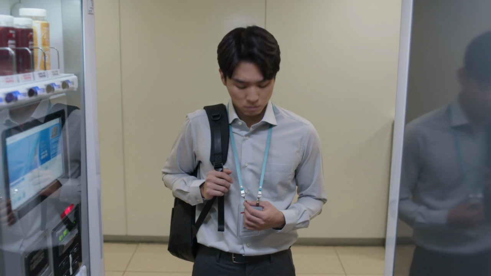

# Sample 09

## 视频画面 (3 帧)

时间顺序：t=0 / t=midpoint / t=end。

[Frame 1: frames/sample_09_frame_01.jpg]

[Frame 2: frames/sample_09_frame_02.jpg]

[Frame 3: frames/sample_09_frame_03.jpg]

## 顾客状态

- **AIDA 阶段**: interest
- **意图**: compare_value_for_money
- **信念 (belief)**: 他认为左右两个区域里的选择都可能适合现在的疲惫状态，但还没看出哪个更值得买。
- **愿望 (desire)**: 他想快速选一个能让自己稍微恢复精力、又不需要花太多时间纠结的选项。
- **意图行为 (intention)**: 他倾向继续在左右两个区域之间比较几秒，再决定是否下单。
- **可观察证据 (observable evidence)**: 他站在原地，目光在左侧和右侧之间来回移动，偶尔轻轻抬起手机又放低，手指无意识地摩挲手机边缘，停留时间略长但没有立即操作。

## 候选介入动作

| ID | 动作类型 | 说话内容 | 屏幕显示 | 物理动作 |
|---|---|---|---|---|
| Elicit_b1166d372e5e | Elicit | 您想先看价格、功能，还是使用场景？ | {'action': 'show_choice_bubbles', 'choices': ['功能', '价格', '场景'], 'cta': None} | 智能售货柜按屏幕、语音、灯效执行该候选响应。 |
| Inform_5ac252a82695 | Inform | 我把这几款的差别列在屏幕上，您可以先比较价格、功能和适合场景。 | {'action': 'show_comparison_or_details', 'target': '{candidate_items}', 'cta': None} | 智能售货柜通过屏幕、语音、灯效和必要的柜体反馈执行响应。 |
| Recommend_interest_stage_conditioned_target_piwm_708_abc684e81696 | Recommend | 如果您想省心选择，可以优先看这款更稳妥的。 | {'action': 'highlight_soft_recommendation', 'cta': None} | 智能售货柜轻量高亮一个选项，并保留顾客选择空间。 |
| Hold_eda24b4bb712 | Hold | （静默） | {'action': 'idle_minimal', 'cta': None} | 智能售货柜按屏幕、语音、灯效执行该候选响应。 |

## 你的选择

请从候选中选一个动作类型，并写到 `annotation_template.csv` 对应行的 `chosen_action` 列。
可选值只能是：`Greet` / `Elicit` / `Inform` / `Recommend` / `Hold`。
