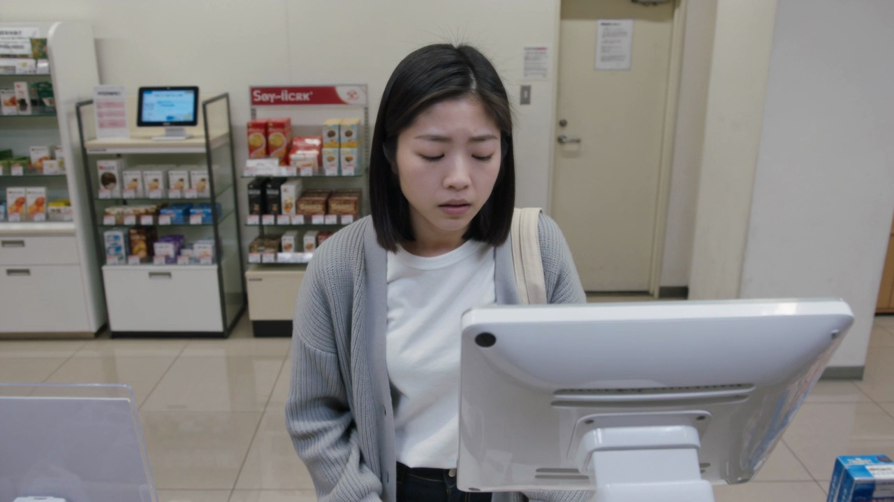
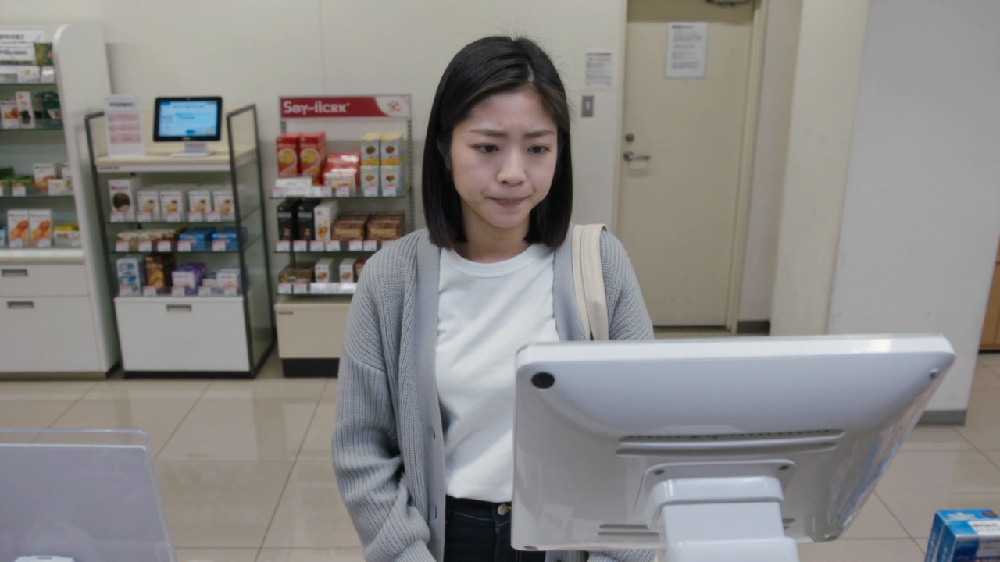
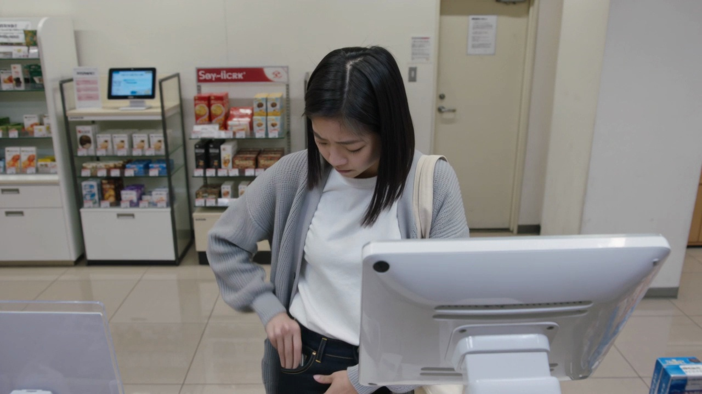

# Sample 11

## 视频画面 (3 帧)

时间顺序：t=0 / t=midpoint / t=end。

[Frame 1: frames/sample_11_frame_01.jpg]

[Frame 2: frames/sample_11_frame_02.jpg]

[Frame 3: frames/sample_11_frame_03.jpg]

## 顾客状态

- **AIDA 阶段**: desire
- **意图**: compare_value_for_money
- **信念 (belief)**: 她认为眼前这款饮品正好符合自己想要提神解渴的需求，选择基本已经明确。
- **愿望 (desire)**: 她想尽快买到机器里的那款产品，减少继续比较的时间。
- **意图行为 (intention)**: 她准备拿出手机进行扫码或支付，进入购买动作。
- **可观察证据 (observable evidence)**: 她起初短暂看向不同位置，随后目光固定在一个方向不再扫视，右手从裤子口袋里掏出手机并抬到胸前。

## 候选介入动作

| ID | 动作类型 | 说话内容 | 屏幕显示 | 物理动作 |
|---|---|---|---|---|
| Inform_053014d173cc | Inform | 我先把价格和优惠信息放在屏幕上，方便您判断。 | {'action': 'show_price_or_discount', 'target': '{selected_item}', 'cta': None} | 智能售货柜通过屏幕、语音、灯效和必要的柜体反馈执行响应。 |
| Recommend_desire_stage_conditioned_target_piwm_713_542ba586daa0 | Recommend | 如果您想省心选择，可以优先看这款更稳妥的。 | {'action': 'highlight_soft_recommendation', 'cta': None} | 智能售货柜轻量高亮一个选项，并保留顾客选择空间。 |
| Hold_eda24b4bb712 | Hold | （静默） | {'action': 'idle_minimal', 'cta': None} | 智能售货柜按屏幕、语音、灯效执行该候选响应。 |

## 你的选择

请从候选中选一个动作类型，并写到 `annotation_template.csv` 对应行的 `chosen_action` 列。
可选值只能是：`Greet` / `Elicit` / `Inform` / `Recommend` / `Hold`。
