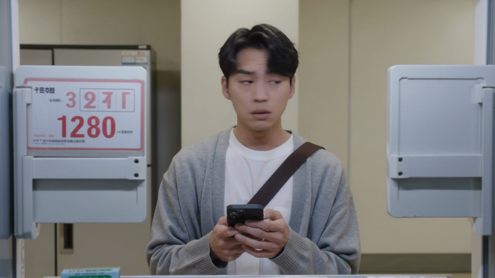
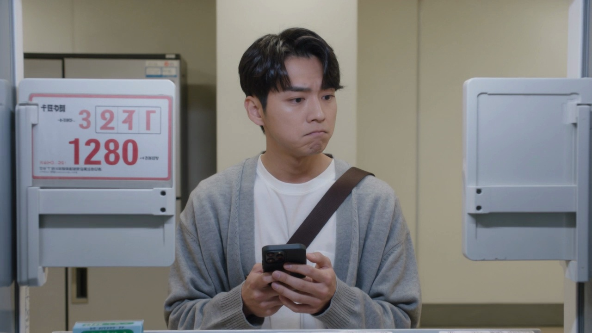
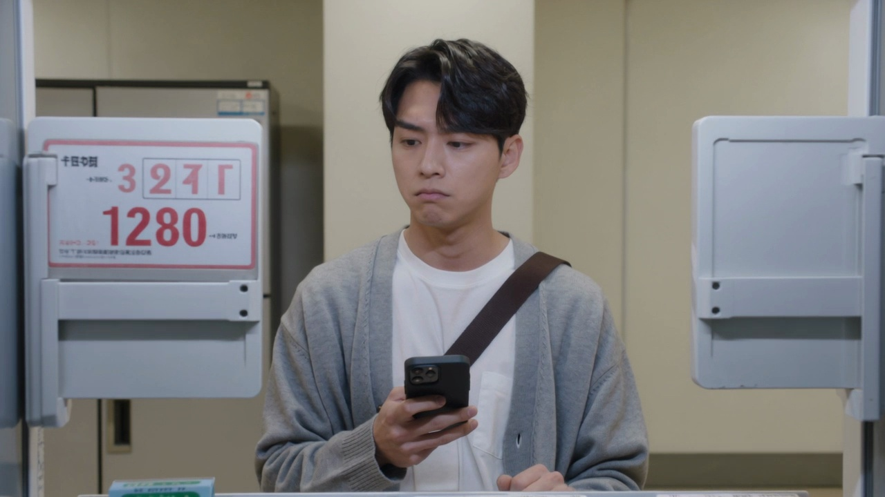

# Sample 12

## 视频画面 (3 帧)

时间顺序：t=0 / t=midpoint / t=end。

[Frame 1: frames/sample_12_frame_01.jpg]

[Frame 2: frames/sample_12_frame_02.jpg]

[Frame 3: frames/sample_12_frame_03.jpg]

## 顾客状态

- **AIDA 阶段**: desire
- **意图**: compare_value_for_money
- **信念 (belief)**: 他认为眼前两个选择都适合现在喝，一个更解渴，另一个看起来更有新鲜感。
- **愿望 (desire)**: 他想买一瓶让自己下午更舒服的饮品，但希望在口味和实用性之间选得更稳妥。
- **意图行为 (intention)**: 他倾向于再看一眼两个方向后做出选择，准备把手伸向其中一个选项。
- **可观察证据 (observable evidence)**: 他的目光在左侧和右侧两个方向之间来回切换，偶尔轻轻点头又停住，握着手机的手指轻微摩挲，另一只手的食指小幅抬起又放下。

## 候选介入动作

| ID | 动作类型 | 说话内容 | 屏幕显示 | 物理动作 |
|---|---|---|---|---|
| Inform_053014d173cc | Inform | 您好，需要时我可以帮您说明。 | {'action': 'show_comparison_or_details', 'target': '{candidate_items}', 'cta': None} | 智能售货柜按屏幕、语音、灯效执行该候选响应。 |
| Recommend_desire_stage_conditioned_target_piwm_714_0624a17ced7a | Recommend | 如果您想省心选择，可以优先看这款更稳妥的。 | {'action': 'highlight_soft_recommendation', 'cta': None} | 智能售货柜轻量高亮一个选项，并保留顾客选择空间。 |
| Hold_eda24b4bb712 | Hold | （静默） | {'action': 'idle_minimal', 'cta': None} | 智能售货柜按屏幕、语音、灯效执行该候选响应。 |

## 你的选择

请从候选中选一个动作类型，并写到 `annotation_template.csv` 对应行的 `chosen_action` 列。
可选值只能是：`Greet` / `Elicit` / `Inform` / `Recommend` / `Hold`。
