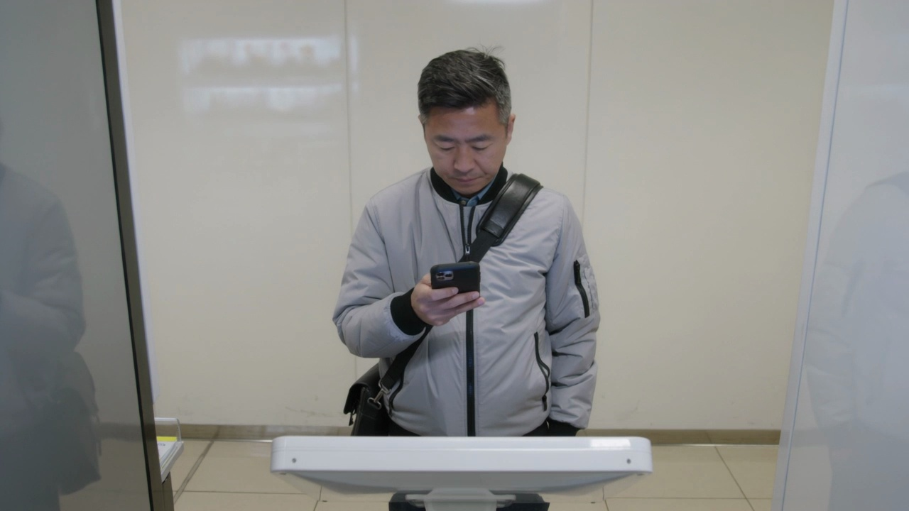
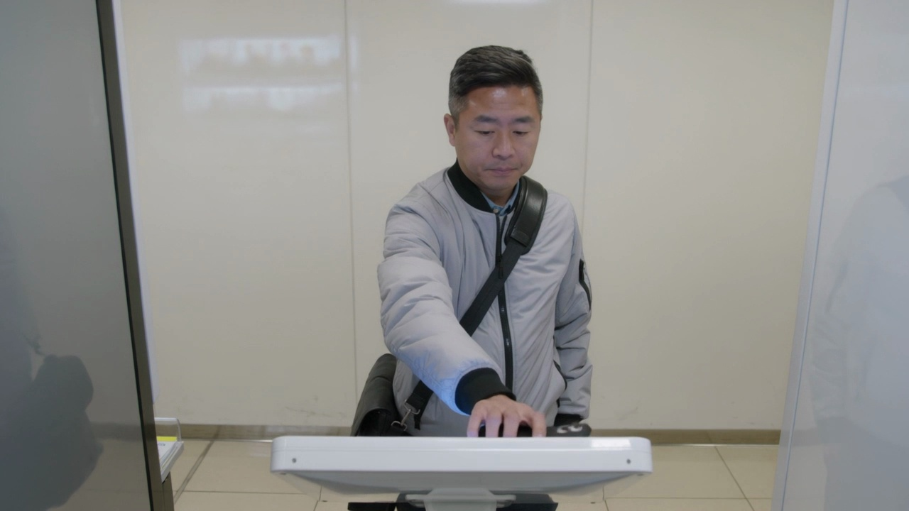
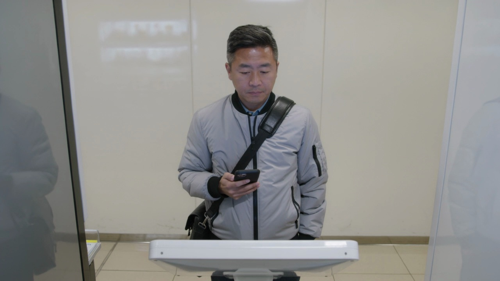

# Sample 14

## 视频画面 (3 帧)

时间顺序：t=0 / t=midpoint / t=end。

[Frame 1: frames/sample_14_frame_01.jpg]

[Frame 2: frames/sample_14_frame_02.jpg]

[Frame 3: frames/sample_14_frame_03.jpg]

## 顾客状态

- **AIDA 阶段**: action
- **意图**: confirm_choice
- **信念 (belief)**: 他认为自己已经选定了合适的饮品，当前只需要快速完成确认。
- **愿望 (desire)**: 他想尽快买到饮品并离开，不在设备前停留太久。
- **意图行为 (intention)**: 他准备直接完成确认动作并等待取货提示。
- **可观察证据 (observable evidence)**: 他视线稳定看向前方偏下位置，动作简洁，右手迅速抬起并在画面下方做一次明确的确认点击，随后把手机收稳，双手自然放回身前。

## 候选介入动作

| ID | 动作类型 | 说话内容 | 屏幕显示 | 物理动作 |
|---|---|---|---|---|
| Greet_889a5021015d | Greet | 感谢惠顾，祝您使用愉快。 | {'action': 'show_thank_you', 'cta': None} | 智能售货柜通过屏幕、语音、灯效和必要的柜体反馈执行响应。 |
| Recommend_action_stage_conditioned_target_piwm_719_91a96e16617b | Recommend | 如果您想省心选择，可以优先看这款更稳妥的。 | {'action': 'highlight_soft_recommendation', 'cta': None} | 智能售货柜轻量高亮一个选项，并保留顾客选择空间。 |
| Hold_eda24b4bb712 | Hold | （静默） | {'action': 'idle_minimal', 'cta': None} | 智能售货柜按屏幕、语音、灯效执行该候选响应。 |

## 你的选择

请从候选中选一个动作类型，并写到 `annotation_template.csv` 对应行的 `chosen_action` 列。
可选值只能是：`Greet` / `Elicit` / `Inform` / `Recommend` / `Hold`。
