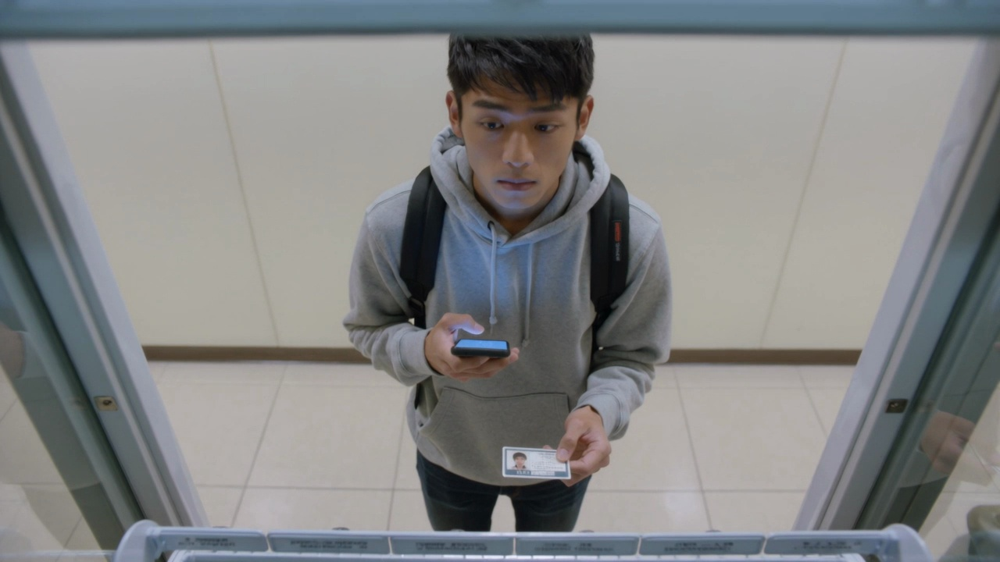
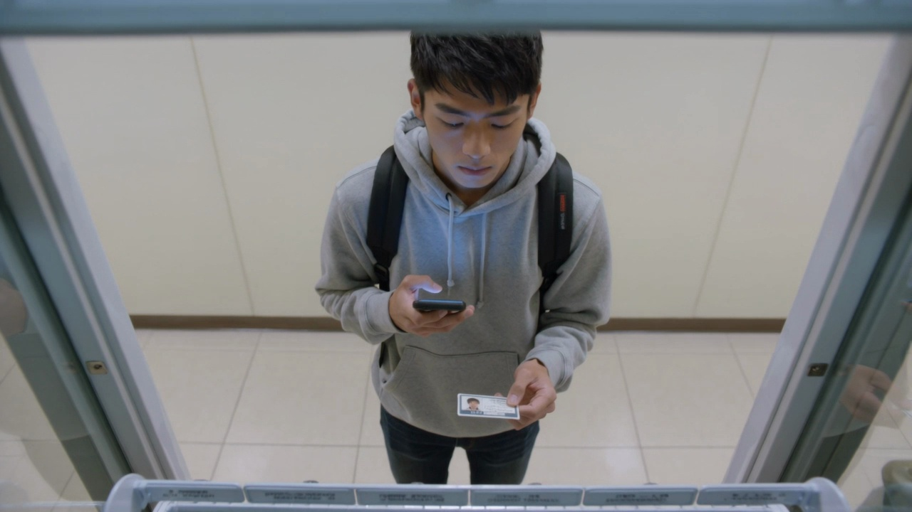
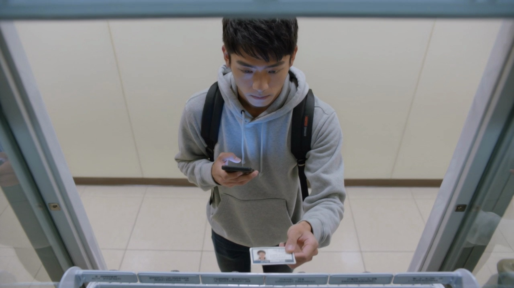

# Sample 20

## 视频画面 (3 帧)

时间顺序：t=0 / t=midpoint / t=end。

[Frame 1: frames/sample_20_frame_01.jpg]

[Frame 2: frames/sample_20_frame_02.jpg]

[Frame 3: frames/sample_20_frame_03.jpg]

## 顾客状态

- **AIDA 阶段**: desire
- **意图**: explore_options
- **信念 (belief)**: 他认为自己已经选定的那款饮品能快速提神，适合下一节课前购买。
- **愿望 (desire)**: 他想尽快完成购买，拿到目标商品后马上回教室。
- **意图行为 (intention)**: 他倾向于接受明确推荐并立刻确认下单，几乎不再继续犹豫。
- **可观察证据 (observable evidence)**: 他始终正面看向前方，视线短暂上下扫动后很快稳定，右手握着手机靠近胸前，左手捏着校园卡，手指轻敲卡片一次，动作干脆克制。

## 候选介入动作

| ID | 动作类型 | 说话内容 | 屏幕显示 | 物理动作 |
|---|---|---|---|---|
| Inform_053014d173cc | Inform | 您好，需要时我可以帮您说明。 | {'action': 'show_comparison_or_details', 'target': '{candidate_items}', 'cta': None} | 智能售货柜按屏幕、语音、灯效执行该候选响应。 |
| Recommend_9ff23b139b07 | Recommend | 这款最适合您，建议直接选这款。 | {'action': 'highlight_single_item_with_cta', 'target': '{recommended_item}', 'cta': 'buy_now'} | 智能售货柜通过屏幕、语音、灯效和必要的柜体反馈执行响应。 |
| Hold_eda24b4bb712 | Hold | （静默） | {'action': 'idle_minimal', 'cta': None} | 智能售货柜按屏幕、语音、灯效执行该候选响应。 |

## 你的选择

请从候选中选一个动作类型，并写到 `annotation_template.csv` 对应行的 `chosen_action` 列。
可选值只能是：`Greet` / `Elicit` / `Inform` / `Recommend` / `Hold`。
