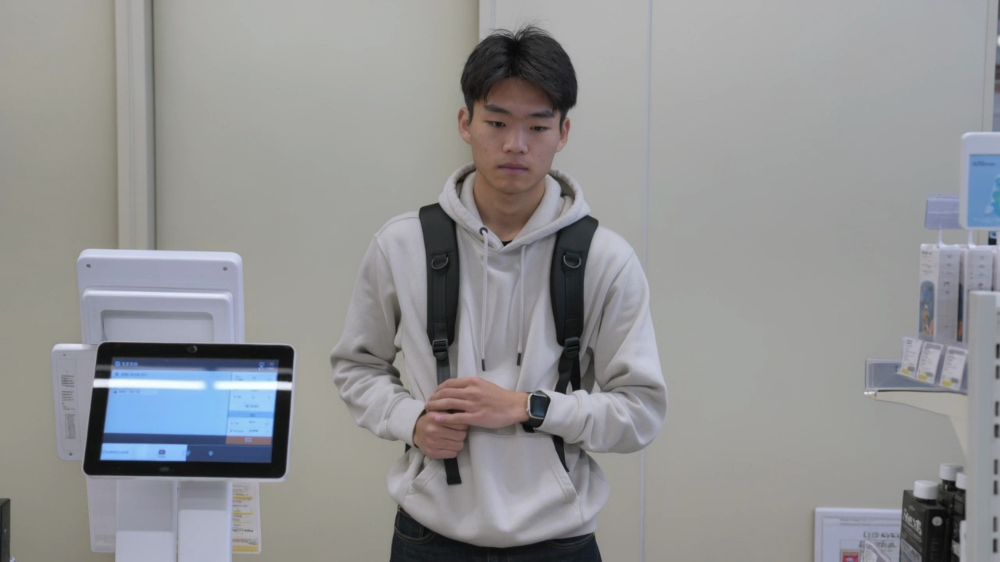
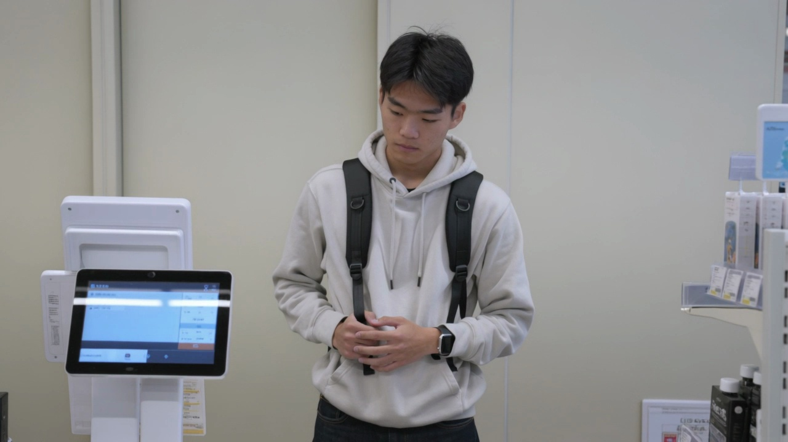
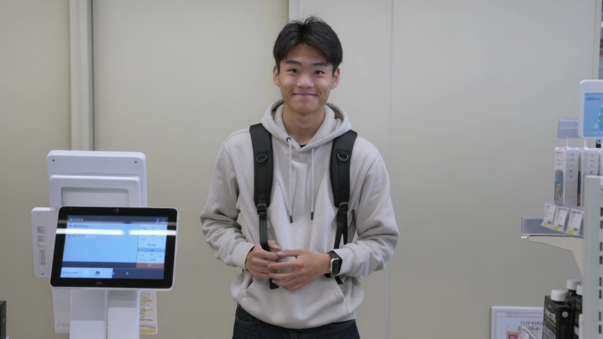

# Sample 24

## 视频画面 (3 帧)

时间顺序：t=0 / t=midpoint / t=end。

[Frame 1: frames/sample_24_frame_01.jpg]

[Frame 2: frames/sample_24_frame_02.jpg]

[Frame 3: frames/sample_24_frame_03.jpg]

## 顾客状态

- **AIDA 阶段**: action
- **意图**: confirm_choice
- **信念 (belief)**: 他认为商品选择和操作流程已经完成，现在只需要等待设备给出结果。
- **愿望 (desire)**: 他想尽快拿到商品，然后回到教室继续上课。
- **意图行为 (intention)**: 他倾向于原地安静等待，确认完成后礼貌点头致意并离开。
- **可观察证据 (observable evidence)**: 他站在原地等待，双手始终在画面内，手指轻轻交握后放松，目光稳定看向正前方偏下位置，最后微微点头作为收尾致意。

## 候选介入动作

| ID | 动作类型 | 说话内容 | 屏幕显示 | 物理动作 |
|---|---|---|---|---|
| Greet_889a5021015d | Greet | 感谢惠顾，祝您使用愉快。 | {'action': 'show_thank_you', 'cta': None} | 智能售货柜通过屏幕、语音、灯效和必要的柜体反馈执行响应。 |
| Recommend_action_stage_conditioned_target_piwm_790_172d0e052b42 | Recommend | 如果您想省心选择，可以优先看这款更稳妥的。 | {'action': 'highlight_soft_recommendation', 'cta': None} | 智能售货柜轻量高亮一个选项，并保留顾客选择空间。 |
| Hold_eda24b4bb712 | Hold | （静默） | {'action': 'idle_minimal', 'cta': None} | 智能售货柜按屏幕、语音、灯效执行该候选响应。 |

## 你的选择

请从候选中选一个动作类型，并写到 `annotation_template.csv` 对应行的 `chosen_action` 列。
可选值只能是：`Greet` / `Elicit` / `Inform` / `Recommend` / `Hold`。
