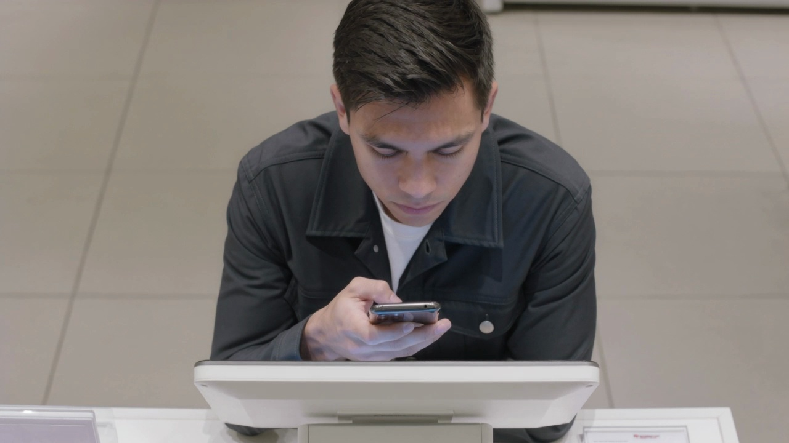

# Sample 30

## 视频画面 (3 帧)

时间顺序：t=0 / t=midpoint / t=end。

[Frame 1: frames/sample_30_frame_01.jpg]

[Frame 2: frames/sample_30_frame_02.jpg]

[Frame 3: frames/sample_30_frame_03.jpg]

## 顾客状态

- **AIDA 阶段**: desire
- **意图**: explore_options
- **信念 (belief)**: 他认为目标商品已经比较符合自己的需要。
- **愿望 (desire)**: 想再自行确认片刻，然后完成决定。
- **意图行为 (intention)**: 继续安静确认，不需要额外推动。
- **可观察证据 (observable evidence)**: 他长时间看向同一位置，偶尔做很轻的视线调整，整体状态稳定。

## 候选介入动作

| ID | 动作类型 | 说话内容 | 屏幕显示 | 物理动作 |
|---|---|---|---|---|
| Inform_desire_stage_conditioned_target_piwm_817_28eeaae97e81 | Inform | 这几款主要区别在口味、容量和价格，我可以帮您快速对比。 | {'action': 'show_comparison_or_details', 'cta': None} | 智能售货柜展示简短对比信息，避免长篇推销。 |
| Recommend_8d7f8993e333 | Recommend | 这款可以作为一个参考选项。 | {'action': 'highlight_item', 'target': '{candidate_item}', 'cta': None} | 智能售货柜按屏幕、语音、灯效执行该候选响应。 |
| Hold_eda24b4bb712 | Hold | （静默） | {'action': 'idle_minimal', 'cta': None} | 智能售货柜通过屏幕、语音、灯效和必要的柜体反馈执行响应。 |

## 你的选择

请从候选中选一个动作类型，并写到 `annotation_template.csv` 对应行的 `chosen_action` 列。
可选值只能是：`Greet` / `Elicit` / `Inform` / `Recommend` / `Hold`。
